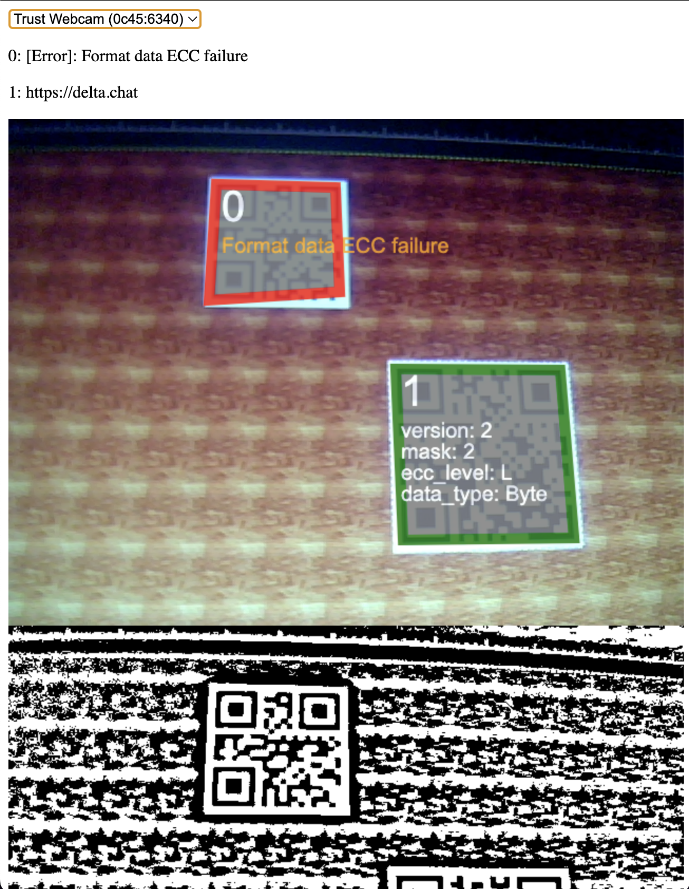

# quircs in wasm

wasm bindings for the [quircs](https://github.com/dignifiedquire/quircs) qrcode scanner library.



## Usage

### Browser

```ts
import init, { read_qrcodes_from_image_data } from "quircs-wasm";

await init("./quircs_wasm_bg.wasm");

var context = canvas.getContext("2d");
// draw your image onto the canvas (from an image file or video input of a camera)
// context.drawImage(video, 0, 0, canvas.width, canvas.height);
const img_data = context.getImageData(0, 0, canvas.width, canvas.height);
const res = read_qrcodes_from_image_data(img_data, true);
for (let qr of res) {
  if (qr.data["content"]) {
    const data = qr.data["content"];
    console.log(qr.corners, ":", data.payload)
  } else {
    console.log("error reading qr code at", qr.corners, ":", qr.data["error"]);
  }
}
```

## Building

### 🛠️ Build with `wasm-pack build`

```
wasm-pack build --target web
```

### 🔬 Test in Headless Browsers with `wasm-pack test`

```
wasm-pack test --headless --firefox
```

### 🎁 Publish to NPM with `wasm-pack publish`

```
wasm-pack publish
```
